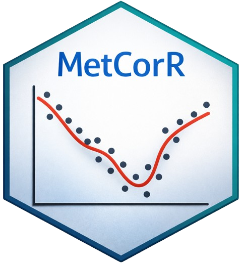

<!-- README.md is generated from README.Rmd. Please edit that file -->

```{r, include = FALSE}
knitr::opts_chunk$set(
  collapse = TRUE,
  comment = "#>",
  fig.path = "man/figures/README-",
  out.width = "100%"
)
```

# MetCorR - QC-based metabolomics LC-MS signal drift correction using GAMs  


[](https://plyush1993.github.io/MetCorR/)

## Installation

You can install the development version of MetCorR like so:

``` r
if (!"remotes" %in% rownames(installed.packages())) {
  install.packages("remotes")}
remotes::install_github("plyush1993/MetCorR", build_vignettes = TRUE)
```

## Example

This is a basic example:

```{r example}
library(MetCorR)

# load example data shipped with the package
data(example_intensity, package = "MetCorR")
data(example_meta,      package = "MetCorR")

# run correction (method = 2 uses both run order and batch)
out <- MetCorR(
  method   = 2,
  int_data = example_intensity,
  order    = example_meta$order,
  class    = example_meta$class,
  batch    = example_meta$batch,
  qc_label = "QC"
)
```
